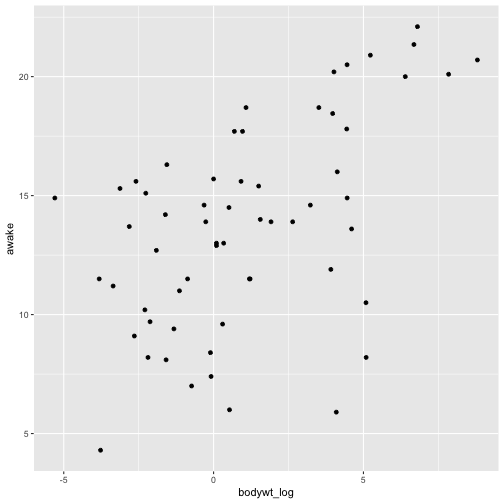
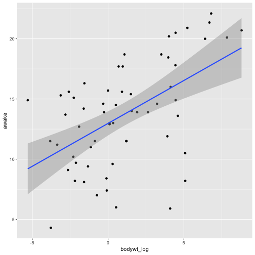

## Basic R

Now, I want to throw you all into the format for the class and
get you started with how assignments will work. This document,
as well as all of your assignments, is written in a format
called **Rmarkdown**. At the moment we are looking at the
source code; if you are familiar with markdown, it is just a
specific flavor of the basic standard.

We can turn markdown into a number of other formats. If I
hit the preview button above, it will display what the
HTML version of the document looks like. I'll usually
export this HTML version and put it on the class website
as it is slightly cleaner than the raw format here.

The powerful feature of **Rmarkdown** is that we can intermix
code into the document and actually run it in real time. To
do this, we enclose code blocks with three backticks, and
preface the first one with r in squiggly brackets. The code
will get run when we hit the Preview or Knit buttons, but
we can also run just this block by hitting the play button to
the right of the block. Here, let's add 1 and 1 together:


1 + 1



## [1] 2


The output is written directly to the document. This is the
reason I'll often use the raw format in class; it allows us
to modify the code and see the changes as they run.

Next, we'll load some libraries into R. These are collections
of functions written by third-parties. We will see how to
install these in a bit. The curly braces part of the code
block accepts several options. Notably, here we turn off
messages as the packages produce quite a bit of verbose
output that we do not need to worry about.


library(readr)
library(ggplot2)
library(dplyr)


Next, let's load in a small dataset to work with today.
This data consists of the average number of hours per
day that various species are awake. We'll read the data
set in from my website:


msleep <- read_csv("~/files/ml_data/msleep.csv")


Once this code has been run, you should see the dataset
pop up in the upper right hand corner of the screen.
Clicking on it opens up a spreedsheet-like view of the
data.

Particularly important are the first two columns, as
most datasets that we work with this semester will have
these columns as well. The first is just an id; the
second indicates whether this is a sample where you
know the response or have to predict the response.
Your goal is to use the data with visible responses
to predict the responses you do not know.

Here, the most straightforward relationship in the data is
that between the logarithm of bodyweight and the number
of hours spent awake. We will use the `qplot` function
to visualize this relationship. The `qplot` function
takes the name of the x-variable, the name of the
y-variable, and the dataset the variables reside inside.
The function is quite smart and will choose by default
the most appropriate plot to use. Here it gives a
scatterplot:


qplot(bodywt_log, awake, data = msleep)



## Warning: Removed 16 rows containing missing values (geom_point).


The missing values are those points where you need to produce
predictions.

It seems like there is a positive relationship between body
weight and hours spent awake. We can add a best-fit line to
the plot to model this relationship. Adding things to a
`qplot` graphic literally involves using the `+` sign and
adding the results of other functions. Here we use `geom_smooth`
with an option to make the smooth strictly linear:


qplot(bodywt_log, awake, data = msleep) +
  geom_smooth(method = "lm")



## Warning: Removed 16 rows containing non-finite values (stat_smooth).



## Warning: Removed 16 rows containing missing values (geom_point).


We can fit the exact some model analytically, rather than graphically,
by calling the `lm` function directly. Here we use an R formula: the
response variable (thing we want to predict), followed by the `~`
sign, followed by the predictor variable. As with the graphics command,
we need to indicate which dataset is being used. The output shows
the slope and intercept of the best-fit-line.


model <- lm(awake ~ bodywt_log, data = msleep)
model



## 
## Call:
## lm(formula = awake ~ bodywt_log, data = msleep)
## 
## Coefficients:
## (Intercept)   bodywt_log  
##     12.9716       0.7128


The function `predict` will give us the predicted values implied
by this line:


predict(model, newdata = msleep)



##         1         2         3         4         5         6         7 
## 15.759974 12.448491 13.185538 10.146737 17.531120 13.932490 15.124130 
##         8         9        10        11        12        13        14 
## 14.852654 14.892262 15.474529 12.745366 14.082221 12.353315 10.966345 
##        15        16        17        18        19        20        21 
## 12.971635  9.195199 13.864556 13.742704 13.349847 18.561589 10.282913 
##        22        23        24        25        26        27        28 
## 17.430492 16.700168 12.785345 14.612829 11.086328 13.822617 11.824490 
##        29        30        31        32        33        34        35 
## 17.820116 17.736168 16.138186 13.659508 15.913297 13.337156 19.246055 
##        36        37        38        39        40        41        42 
## 12.262971 14.337944 10.877925 11.460394 10.582169 10.251230  9.689248 
##        43        44        45        46        47        48        49 
## 12.027755 13.211460 11.859266 10.423121 13.624732 15.834358 15.790665 
##        50        51        52        53        54        55        56 
## 16.600355 16.254023 16.595670 15.272594 13.039569 16.146522 15.803923 
##        57        58        59        60        61        62        63 
## 13.039569 15.889926 12.159491 10.745279 12.759903 11.125393 11.609874 
##        64        65        66        67        68        69        70 
## 12.912204 11.337534 11.842090 16.148591 14.043684 11.411218 16.774314 
##        71        72        73        74        75        76 
## 12.896539 11.358397 16.646061 13.465684 13.839690 13.999581


Columns of the dataset `msleep` can be referenced by
using the dataset name, followed by a dollar sign and
the name of the variable. So, for example, here are the
hours spent awake:


msleep$awake



##  [1] 11.90  7.00  9.60    NA 20.00    NA    NA 13.90    NA 18.70 14.60
## [12] 14.00 11.50 13.70 15.70 14.90    NA 18.70  6.00 20.10  4.30    NA
## [23] 20.90 13.90    NA  9.10 11.50 14.20 22.10 21.35 17.80 17.70 16.00
## [34] 14.50 20.70    NA 13.90    NA  9.70 11.20 11.50    NA  9.40 13.00
## [45] 16.30    NA 15.60 20.20    NA  8.20 13.60 10.50 14.60 13.00 20.50
## [56] 18.45 12.90  5.90 11.00 15.30    NA 15.60 12.70  7.40 10.20  8.10
## [67] 14.90 15.40  8.20    NA  8.40 15.10    NA 17.70 11.50    NA


The `NA`'s correspond to the missing values we want to predict.
Similarly, we can add a new variable by simply referencing it
with the `$` and assigning it to something. Here, we add those
predictions back into the msleep dataset:


msleep$awake_pred <- predict(model, msleep)


Click on the msleep dataset again to verify that there is a
new column of predictions. Notice that these are filled in
for all values.

Now, we use the `select` function to pick just a few
variables from `msleep` and save this as a new dataset.
The select function takes the name of the dataset first,
followed by whatever variable names we want to keep. Here
we include just the observation id and our prediction:


submit <- select(msleep, obs_id, awake_pred)


Look at the `submit` dataset and verify that it is what
you would expect.

Finally, the `write_csv` function will save a dataset
to a file. Each of the columns will be seperated by a
comma (that's what the 'c' stands for in csv) and the
rows will be seperated by a new line:


write_csv(submit, "class01_submit.csv")


This is the kind of file I expect you to produce for
each class assignment. Notice that we've created predictions
for all of the data, even though we already know some of the
values. It is often easier to do this and avoids the mistake
of predicting on the wrong set. Of course, I'll only grade
you on the set that you were not able to see.

