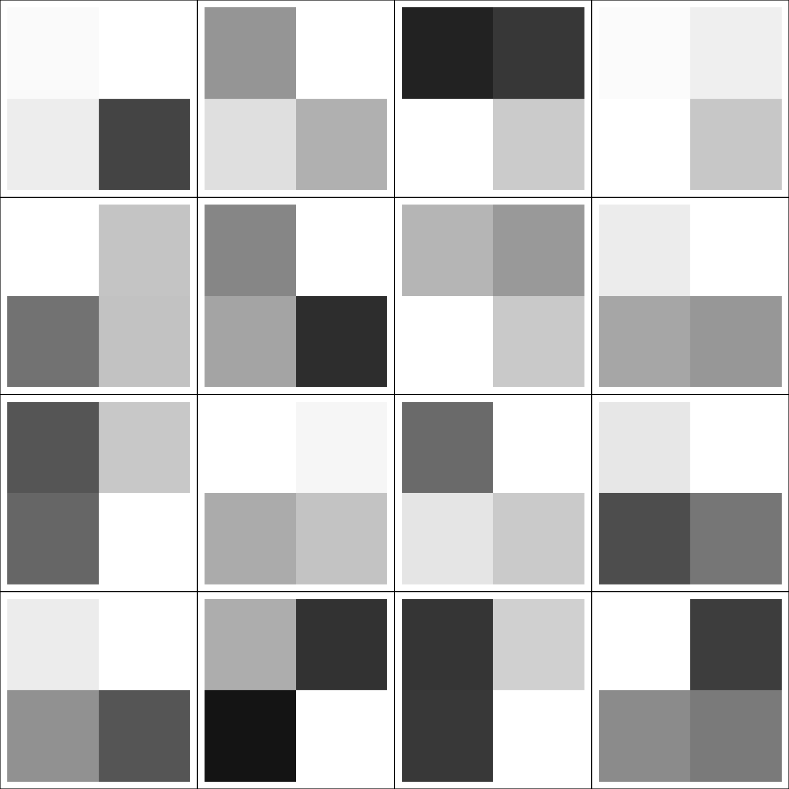


library(readr)
library(ggplot2)
library(dplyr)
library(methods)
library(keras)



mnist <- read_csv("~/files/ml_data/mnist_10.csv")
X <- read_rds("~/files/ml_data/mnist_10_X.rds")



## Warning in gzfile(file, "rb"): cannot open compressed file '/Users/taylor/
## files/ml_data/mnist_10_X.rds', probable reason 'No such file or directory'



## Error in gzfile(file, "rb"): cannot open the connection



X <- array(X, dim = c(dim(X), 1))



## Error in array(X, dim = c(dim(X), 1)): object 'X' not found



y <- mnist$class

X_train <- X[mnist$train_id == "train",,,,drop = FALSE]



## Error in eval(expr, envir, enclos): object 'X' not found



y_train <- to_categorical(y[mnist$train_id == "train"], num_classes = 10)



model <- keras_model_sequential()
model %>%
  layer_conv_2d(filters = 32, kernel_size = c(2,2),
                  strides = c(2,2),
                  input_shape = c(28, 28, 1)) %>%
  layer_activation(activation = "relu") %>%
  layer_max_pooling_2d(pool_size = c(2, 2)) %>%
  layer_dropout(rate = 0.5) %>%

  layer_flatten() %>%
  layer_dense(units = 10) %>%
  layer_activation(activation = "softmax")

model %>% compile(loss = 'categorical_crossentropy',
                  optimizer = optimizer_rmsprop(),
                  metrics = c('accuracy'))

model



## Model
## ___________________________________________________________________________
## Layer (type)                     Output Shape                  Param #     
## ===========================================================================
## conv2d_1 (Conv2D)                (None, 14, 14, 32)            160         
## ___________________________________________________________________________
## activation_1 (Activation)        (None, 14, 14, 32)            0           
## ___________________________________________________________________________
## max_pooling2d_1 (MaxPooling2D)   (None, 7, 7, 32)              0           
## ___________________________________________________________________________
## dropout_1 (Dropout)              (None, 7, 7, 32)              0           
## ___________________________________________________________________________
## flatten_1 (Flatten)              (None, 1568)                  0           
## ___________________________________________________________________________
## dense_1 (Dense)                  (None, 10)                    15690       
## ___________________________________________________________________________
## activation_2 (Activation)        (None, 10)                    0           
## ===========================================================================
## Total params: 15,850
## Trainable params: 15,850
## Non-trainable params: 0
## ___________________________________________________________________________



history <- model %>%
  fit(X_train, y_train, epochs = 10,
      validation_split = 0.1)



## Error in normalize_x(x): object 'X_train' not found



plot(history)



## Error in .External2(C_savehistory, file): no history available to save


## Double Convolution


model <- keras_model_sequential()
model %>%
  layer_conv_2d(filters = 32, kernel_size = c(3, 3),
                  input_shape = c(28, 28, 1)) %>%
  layer_activation(activation = "relu") %>%
  layer_conv_2d(filters = 32, kernel_size = c(3,3)) %>%
  layer_activation(activation = "relu") %>%
  layer_max_pooling_2d(pool_size = c(2, 2)) %>%
  layer_dropout(rate = 0.5) %>%

  layer_flatten() %>%
  layer_dense(units = 128) %>%
  layer_activation(activation = "relu") %>%
  layer_dropout(rate = 0.5) %>%
  layer_dense(units = 10) %>%
  layer_activation(activation = "softmax")

model %>% compile(loss = 'categorical_crossentropy',
                  optimizer = optimizer_rmsprop(),
                  metrics = c('accuracy'))

model



## Model
## ___________________________________________________________________________
## Layer (type)                     Output Shape                  Param #     
## ===========================================================================
## conv2d_2 (Conv2D)                (None, 26, 26, 32)            320         
## ___________________________________________________________________________
## activation_3 (Activation)        (None, 26, 26, 32)            0           
## ___________________________________________________________________________
## conv2d_3 (Conv2D)                (None, 24, 24, 32)            9248        
## ___________________________________________________________________________
## activation_4 (Activation)        (None, 24, 24, 32)            0           
## ___________________________________________________________________________
## max_pooling2d_2 (MaxPooling2D)   (None, 12, 12, 32)            0           
## ___________________________________________________________________________
## dropout_2 (Dropout)              (None, 12, 12, 32)            0           
## ___________________________________________________________________________
## flatten_2 (Flatten)              (None, 4608)                  0           
## ___________________________________________________________________________
## dense_2 (Dense)                  (None, 128)                   589952      
## ___________________________________________________________________________
## activation_5 (Activation)        (None, 128)                   0           
## ___________________________________________________________________________
## dropout_3 (Dropout)              (None, 128)                   0           
## ___________________________________________________________________________
## dense_3 (Dense)                  (None, 10)                    1290        
## ___________________________________________________________________________
## activation_6 (Activation)        (None, 10)                    0           
## ===========================================================================
## Total params: 600,810
## Trainable params: 600,810
## Non-trainable params: 0
## ___________________________________________________________________________



history <- model %>%
  fit(X_train, y_train, epochs = 1,
      validation_split = 0.1)



## Error in normalize_x(x): object 'X_train' not found



plot(history)



## Error in .External2(C_savehistory, file): no history available to save


## Negative examples again


y_pred <- predict_classes(model, X)



## Error in normalize_x(x): object 'X' not found



table(y[mnist$train_id == "train"], y_pred[mnist$train_id == "train"])



## Error in table(y[mnist$train_id == "train"], y_pred[mnist$train_id == : object 'y_pred' not found



par(mar = c(0,0,0,0))
par(mfrow = c(10, 10))
for (i in sample(which(y_pred != y), 100)) {
  plot(0,0,xlim=c(0,1),ylim=c(0,1),axes= FALSE,type = "n")
  rasterImage(X[i,,,],0,0,1,1)
  text(0.1,0.1,y[i],col="blue", cex = 3)
  text(0.9,0.1,y_pred[i],col="red", cex = 3)
  box()
}



## Error in which(y_pred != y): object 'y_pred' not found


## Visualize the kernels


layer <- get_layer(model, index = 1)
dim(layer$get_weights()[[1]])



## [1]  3  3  1 32



dim(layer$get_weights()[[2]])



## [1] 32



par(mar = c(0,0,0,0))
par(mfrow = c(8, 4))
for (i in 1:32) {
  wg <- layer$get_weights()[[1]][,,,i]
  im <- abs(wg) / max(abs(wg))
  sg <- sign(wg)
  plot(0,0,xlim=c(0,1),ylim=c(0,1),axes= FALSE,type = "n")
  rasterImage(im,0,0,1,1,interpolate=FALSE)
  box()
  text(row(sg) / 3 - 1/6, col(sg) / 3 - 1/6,
       label = sg, col = "salmon", cex = 3)
}


